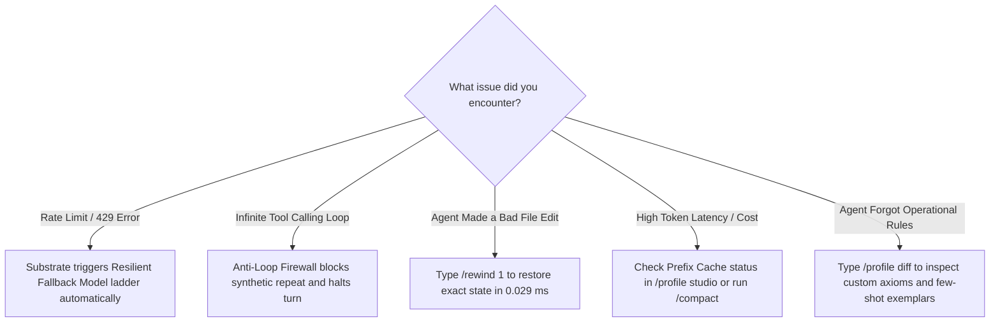

# ❓ Interactive FAQ & Self-Intuitive Onboarding Guide

An ultra-intuitive, task-oriented master guide designed to flatten your onboarding curve to zero. Get running in seconds, understand your screen at a glance, and master the full power of **LUMI-JOY**.

---

## 🚀 60-Second Quick Start: Zero-to-Hero in 3 Steps


### Step 1: Clone & Build
```bash
git clone https://github.com/CardSorting/LUMI-JOY.git
cd LUMI-JOY
npm install && npm run build
```

### Step 2: Configure Your Provider (Guided Wizard)
Set up your LLM credentials (OpenAI Codex with OAuth PKCE, Anthropic, or local endpoints):
```bash
npx tsx src/index.ts --setup
```

### Step 3: Launch with a Specialized Agent Persona
```bash
npx tsx src/index.ts --profile coder
```

---

## 🖥️ What You See on Your Screen (Canvas Anatomy)

When you start LUMI-JOY, the differential terminal interface presents an intuitive layout:

```text
╔══════════════════════════════════════════════════════════════════════════════════════════╗
║ ⚡ LUMI-JOY v1.0.0 │ 👤 [💻 Coder] │ 🧠 [gpt-5.6-luna] │ ⏱️ 0.12ms │ 💰 $0.0018 │ ⭐ Fav ║
╠══════════════════════════════════════════════════════════════════════════════════════════╣
║                                                                                          ║
║  👤 You: Refactor src/core/auth.ts to add strict token expiration validation             ║
║                                                                                          ║
║  ⚡ LUMI (Coder):                                                                        ║
║  ┌────────────────────────────────────────────────────────────────────────────────────┐  ║
║  │ 🔧 Tool: read_file ("src/core/auth.ts") ➔ Status: OK (124 lines)                  │  ║
║  │ 🔧 Tool: patch ("src/core/auth.ts") ➔ Line-anchored edit verified (0.04ms)         │  ║
║  └────────────────────────────────────────────────────────────────────────────────────┘  ║
║  I have added strict JWT expiration claims verification and unit test assertions.        ║
║                                                                                          ║
╠══════════════════════════════════════════════════════════════════════════════════════════╣
║ 💡 Shortcuts: [Ctrl+M] Model  [Ctrl+P] Setup  [/profile] Switch Persona  [Ctrl+C] Abort  ║
╠══════════════════════════════════════════════════════════════════════════════════════════╣
║ (lumi:coder) > _                                                                         ║
╚══════════════════════════════════════════════════════════════════════════════════════════╝
```

---

## 🎯 "I Want To..." Task-Oriented Cookbook

Find your goal and execute the solution with zero guesswork:

| What I Want to Do | Exact Command to Type | What Happens Behind the Scenes |
| :--- | :--- | :--- |
| **Write or refactor code with strict types** | `/profile use coder` | Activates TypeScript LSP, AST parsers, line-anchored patchers, and unit testing axioms. |
| **Inspect staged file diffs before writing to disk** | `/diff [path]` | Synthesizes real-time unified diffs comparing disk files against staged VFS overlays without disk writes. |
| **Commit staged file changes to disk** | `/commit [path]` | Atomically commits staged virtual file modifications directly to disk. |
| **Revert experimental file changes** | `/discard [path]` | Discards staged VFS file modifications and restores the original disk file. |
| **Perform deep academic or web research** | `/profile use researcher` | Activates citation rigor, arXiv tools, fact verification, and web intelligence. |
| **Triage a production bug or system crash** | `/profile use sre` | Activates doctor diagnostics, log ring buffers, health probes, and self-healing tools. |
| **Search code symbols with typo-tolerance & captures** | `grep_search` | Uses native zero-subprocess in-memory search with fuzzy matching, regex captures, and comment filtering. |
| **Free a port locked by a ghost dev server** | `kill_port :3000` | Automatically finds and kills background processes blocking the specified TCP port. |
| **Draft architecture ADRs or documentation** | `/profile use writer` | Activates Keep-a-Changelog schemas, Mermaid diagram synthesis, and technical style guides. |
| **Undo the agent's last file modification** | `/rewind 1` | Rolls back supported virtual files, memory, and conversation history when a valid checkpoint exists; timing is workload-specific. |
| **Create my own customized agent persona** | `/profile init coder my_lead_dev` | Clones the battle-tested Coder blueprint into your isolated custom profile. |
| **Compare two agent profiles side-by-side** | `/profile diff default my_lead_dev` | Generates a structural delta of toolsets, soul prompts, custom axioms, and memory. |
| **Hot-swap the AI model without restarting** | `Ctrl+M` *(or `/model claude-3-7-sonnet`)* | Routes future turns to the selected model when provider configuration permits; cache retention depends on request shape and provider policy. |
| **Inspect database tables and memory facts** | `/db status` *(or `/db query profiles`)* | Opens the BroccoliDB reactive in-memory database inspection studio. |
| **Open the full 6-tab Profile Studio Modal** | `/profile` *(or press `Tab` / `1-6` in modal)* | Opens the interactive visual orchestrator for profiles, blueprints, revisions, and health. |

---

## 👤 Built-in Agent Blueprint Matrix (ADR-119)

Choose from 7 curated blueprints with tailored prompt axioms, toolsets, and reasoning profiles:

| Blueprint | Icon | Primary Focus | Best Model | Toolsets Included |
| :--- | :---: | :--- | :--- | :--- |
| **`coder`** | 💻 | Software Engineering, Refactoring & Test Generation | `gpt-5.6-luna` | `core`, `files`, `execution`, `lsp`, `git` |
| **`researcher`** | 🔬 | Deep Academic Literature Synthesis & Fact Checking | `claude-3-7-sonnet` | `core`, `files`, `web`, `memory` |
| **`sre`** | 🛡️ | Incident Triage, System Forensics & Self-Healing | `gpt-5.6-luna` | `core`, `files`, `execution`, `git`, `doctor` |
| **`writer`** | ✍️ | Technical Documentation, Architecture ADRs & Guides | `claude-3-7-sonnet` | `core`, `files`, `memory` |
| **`student`** | 🎓 | Socratic Learning Tutor & Interactive Walkthroughs | `gpt-4o` | `core`, `files`, `memory` |
| **`creative`** | 🎨 | Game Design, Mechanics Worldbuilding & Creative Assets | `gpt-4o` | `core`, `files`, `vision`, `memory` |
| **`minimal`** | ⚡ | Headless High-Speed Scripting with Minimal Tokens | `gpt-4o-mini` | `core`, `files` |

---

## ⌨️ Universal Keyboard Shortcuts

| Shortcut | Context | Function |
| :--- | :--- | :--- |
| `Ctrl+C` / `Esc` | Global | **Emergency Abort**: Halts running models, restores terminal state, and cancels pending tool loops. |
| `Ctrl+M` | Global | **Model Switcher Modal**: Quick hotkey to toggle between OpenAI, Anthropic, DeepSeek, and local models. |
| `Ctrl+P` | Global | **Setup Wizard**: Guided provider authentication and API key manager. |
| `Ctrl+L` | Global | **Repaint Screen**: Clears buffer and redraws ANSI canvas to adapt to terminal resize. |
| `Tab` | Input Mode | **Smart Autocomplete**: Tab-completes slash commands (`/profile`, `/rewind`) and workspace paths. |
| `PageUp` / `PageDown` | View Mode | **Timeline Scroll**: Inspect previous model responses, diff blocks, and tool logs. |
| `1` – `6` | Profile Modal | **Direct Tab Switch**: Jump between `[1] Profiles`, `[2] Blueprints`, `[3] Revisions`, `[4] Exemplars`, `[5] SLA Health`, `[6] Raw JSON`. |

---

## 🛠️ Self-Healing Troubleshooting & Decision Tree



### Common Gotchas & 1-Second Fixes

| Symptom | Cause | 1-Second Fix |
| :--- | :--- | :--- |
| **`Command not found: lumi`** | Monolith not linked globally | Run `npx tsx src/index.ts` or run `npm link` in the root folder. |
| **`Missing Provider API Key`** | No credentials configured | Run `npx tsx src/index.ts --setup` or export `OPENAI_API_KEY="sk-..."`. |
| **`Rate limit exceeded (429)`** | Provider quota limit reached | Fallback ladder routes automatically, or press `Ctrl+M` to switch providers. |
| **`Agent edited the wrong file`** | LLM hallucination or stale context | Run `/rewind 1` to instantly undo the file edit and prompt again. |
| **`Terminal borders wrapping`** | Terminal window resized too narrow | Press `Ctrl+L` to repaint canvas to fit your new window width. |

---

## 🏗️ Architecture & Core Concepts (FAQ)

### Q: What is LUMI-JOY and what core problem does it solve?
**LUMI-JOY** is a TypeScript coding companion and multi-agent framework with a deterministic game-engine-inspired execution model. It uses ordered frame phases, selected arena-backed state paths, and snapshot-oriented recovery; host scheduling, provider calls, filesystem state, and runtime allocation can still vary or fail. See the dated baseline for workload-specific measurements rather than treating these behaviors as SLAs.

### Q: Why is the LUMI-JOY agent runtime modeled after video game engines?
Video-game architecture is a useful analogy, not a guarantee of predictable frame rates or leak-free behavior. Modeling the lifecycle this way establishes testable design targets:
1. **Ordered frame phases (`tick()`)**: A modeled lifecycle (`Input -> Context Assembly -> Provider Dispatch -> State Mutation -> Telemetry`).
2. **Configured arena memory**: A 16 MB `ArrayBuffer` can back selected state paths; the process remains capable of ordinary allocation and garbage collection.
3. **Snapshot-oriented rewind**: Supported virtual files, transcripts, and facts can be restored from valid checkpoints; timing and completeness depend on the workload.
4. **In-process dispatch**: Direct calls can be benchmarked locally, but throughput remains host- and workload-specific.

### Q: How does Prefix Cache Frame Decomposition affect repeated prompt work?
Traditional prompt templating can change byte-level prefixes across turns. LUMI-JOY's **Prefix Cache Frame Engine** ([ADR-119](../.wiki/adr/ADR-119-persistent-multi-profile-isolation-and-routing.md)) partitions prompt context into deterministic blocks:
1. `systemBlock`: Identity, category, and immutable operational axioms.
2. `toolsBlock`: Enabled toolsets and MCP server declarations.
3. `knowledgeBlock`: Pinned RAG knowledge scopes.
4. `exemplarsBlock`: In-context learning few-shot demonstration pairs.
5. `dynamicBlock`: Runtime hydrated variables (`{{workspace.root}}`, `{{session.id}}`).
By computing a cryptographic SHA-256 `PrefixCacheHash` over static blocks and preserving a stable serialization order where supported, the client can make repeated prompt structure easier to inspect. Provider cache eligibility, billing, hit rates, and first-token latency remain provider- and workload-dependent; no savings percentage is promised.

### Q: What is BroccoliDB and why doesn't LUMI-JOY use external SQLite binaries?
**BroccoliDB** is LUMI-JOY's built-in in-memory + hybrid persistence database kernel ([ADR-120](../.wiki/adr/ADR-120-deterministic-hybrid-inmemory-broccolidb-kernel.md)):
- **Zero External Dependencies**: Eliminates C/C++ native addons, Python SQLite locks, and cross-platform compilation failures.
- **Measured lookup path**: Pure TypeScript in-memory reactive tables (`BroccoliDbTable<T>`) can be benchmarked for primary/secondary index lookups; the result is workload-specific.
- **256-Way Sharded CAS**: Content-addressable storage with adaptive Brotli compression, cryptographic SHA-256 verification, and bit-rot quarantine.
- **Append-Only WAL Journal**: Micro-batched write-ahead logging with cryptographic hash chaining and cold-start crash replay.
- **Git-for-Data Branching & Aggregations**: Supports Copy-on-Write table branching (`forkBranch`), 3-way merge conflict resolution, and statistical aggregation pipelines (`groupBy`, `HAVING`, `SUM`, `AVG`, `STDDEV`).

---

## 🛠️ Tool Calling & Execution Ergonomics (FAQ)

### Q: How does LUMI support OpenAI, Anthropic, Gemini, and MCP simultaneously without code changes?
LUMI incorporates a **Universal Multi-Provider Wire Adapter** (`UniversalToolCallAdapter` / [ADR-138](adr/ADR-138-apex-tier-multi-provider-tool-calling-and-execution-ergonomics.md)) and **Tool Schema Serializer** (`ToolSchemaSerializer`). Every tool is declared once as a standard typed `ToolDefinition`. The serializer automatically converts it into:
- **OpenAI**: `{ type: "function", function: { name, description, parameters, strict: true } }`
- **Anthropic**: `{ name, description, input_schema }`
- **Google Gemini**: `{ functionDeclarations: [{ name, description, parameters }] }`
- **MCP**: `{ name, description, inputSchema }`
When models invoke tools, the wire adapter translates provider-specific payloads (`tool_calls`, `tool_use`, `functionCall`) into a unified execution envelope, and formats execution outputs back into the exact provider format.

### Q: How does the 4-Pass Self-Healing Argument Parser prevent turn crashes?
LLMs frequently emit malformed arguments that crash standard JSON parsers. LUMI's `ToolCallArgParser` runs a 4-pass healing cascade:
1. **Pass 1 (Fence Sanitization)**: Strips markdown markdown code fences (` ```json `), unescapes raw newlines, and trims whitespace.
2. **Pass 2 (Syntax Auto-Repair)**: Converts Python literals (`True` -> `true`, `False` -> `false`, `None` -> `null`), replaces unquoted single quotes, fixes trailing commas, and balances missing closing braces.
3. **Pass 3 (Substring Extraction)**: Uses brace-matching state machines to extract embedded JSON blocks when models emit explanatory text alongside tool calls.
4. **Pass 4 (Type Coercion)**: Auto-converts stringified numbers (`"42"` -> `42`), booleans (`"true"` -> `true`), and stringified JSON objects into their expected schema types.

### Q: How does Parallel Concurrency Wave Scheduling affect multi-file inspection?
When an LLM requests multiple tool invocations in a single turn (e.g. reading 4 different files), standard agent loops execute them one after another. LUMI's `ToolExecutionScheduler` ([ADR-139](adr/ADR-139-zenith-tier-tool-scheduling-caching-governance-and-auto-healing.md)) analyzes tools for mutating side effects:
- **Read-Only Waves**: Executed concurrently via `Promise.allSettled`, parallelizing I/O.
- **Mutating Waves**: Executed in strict serial order to preserve atomic filesystem consistency in the modeled wave; filesystem, host, and crash behavior still require verification.
This partitioning can reduce wall-clock time for independent reads on some hosts. Measure the named workload before making a comparative speed or cost claim.

### Q: How does In-Memory Read Caching work without returning stale files?
LUMI's `ToolExecutionCache` computes a SHA-256 hash of `(toolName, sortedArgs, cwd)` for supported cache keys. Idempotent reads may be served from cache; latency and freshness depend on cache state and filesystem conditions. Whenever a supported mutating tool executes, the cache invalidates entries for the modified path and applicable parent directories.

### Q: What is the Tool Loop Breaker and how does it stop infinite loops?
Runaway hallucination loops occur when an agent repeatedly invokes identical tool calls after hitting an error. LUMI's `ToolLoopBreaker` ([ADR-140](adr/ADR-140-sentinel-tier-confirmation-gates-loop-breaking-and-transactional-rollback.md)) tracks recent calls in a sliding ring buffer. If 3 consecutive calls share the exact same tool name and argument signature, the breaker halts execution and injects an actionable advisory prompting the model to switch strategies.

### Q: How does the Atomic Mutation Journal support rollback via `rollback_last_mutation`?
Before supported file mutations, LUMI's `ToolTransactionJournal` ([ADR-140](adr/ADR-140-sentinel-tier-confirmation-gates-loop-breaking-and-transactional-rollback.md)) records the pre-mutation state or flags a newly created file. The model or developer can invoke `rollback_last_mutation` (or `/rewind`) when a valid journal entry exists; restoration depends on the path, process state, and filesystem.

### Q: How does Topological DAG Planning handle dependent tool data pipelines?
When multi-tool turns contain data dependencies (e.g. Node 1 finds a path, and Node 2 reads `$node1.result.path`), LUMI's `ToolDependencyGraphPlanner` ([ADR-141](adr/ADR-141-apex-tier-middleware-pipelines-schema-compression-and-dag-orchestration.md)) performs Kahn's topological sort, verifies cycle freedom, groups independent branches into concurrent waves, and resolves piped variable substitutions dynamically as upstream nodes complete.

### Q: How does Tool Schema Compression affect prompt size?
Exposing verbose JSON schemas can consume context. LUMI's `ToolSchemaCompressor` ([ADR-141](adr/ADR-141-apex-tier-middleware-pipelines-schema-compression-and-dag-orchestration.md)) can minify supported parameter schemas into dense descriptors while preserving the fields required by the selected adapter; compression ratio and semantic coverage require workload-specific validation.

---

## 🌐 Model Providers (FAQ)

### Q: Which LLM provider is supported in LUMI?
LUMI currently focuses on **OpenAI Codex** with OAuth PKCE, plus configured local or custom endpoints.

### Q: How do I configure credentials?
Run `npx tsx src/index.ts --setup` (or press `Ctrl+P` / type `/setup` inside the TUI) and follow the guided setup.

---

## Related Documentation

- [Runtime Architecture Guide](RUNTIME_ARCHITECTURE_GUIDE.md)
- [TUI Commands & Keybindings Guide](TUI_COMMANDS_GUIDE.md)
- [Master Architecture Decision Records (ADR) Workspace](adr/README.md)
- [ADR-138: Apex-Tier Multi-Provider Tool Calling](adr/ADR-138-apex-tier-multi-provider-tool-calling-and-execution-ergonomics.md)
- [ADR-139: Zenith-Tier Parallel Tool Scheduling & Caching](adr/ADR-139-zenith-tier-tool-scheduling-caching-governance-and-auto-healing.md)
- [ADR-140: Sentinel-Tier Confirmation Gates & Rollback Journals](adr/ADR-140-sentinel-tier-confirmation-gates-loop-breaking-and-transactional-rollback.md)
- [ADR-141: Apex-Tier Middleware Pipelines & DAG Orchestration](adr/ADR-141-apex-tier-middleware-pipelines-schema-compression-and-dag-orchestration.md)
- [Architecture & Subsystem Diagrams](ARCHITECTURE_DIAGRAMS.md)
- [Live Baseline Evidence](LIVE_BASELINE.json)
